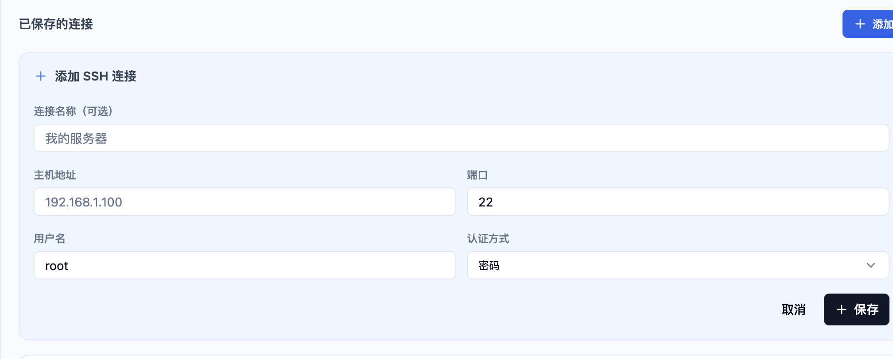
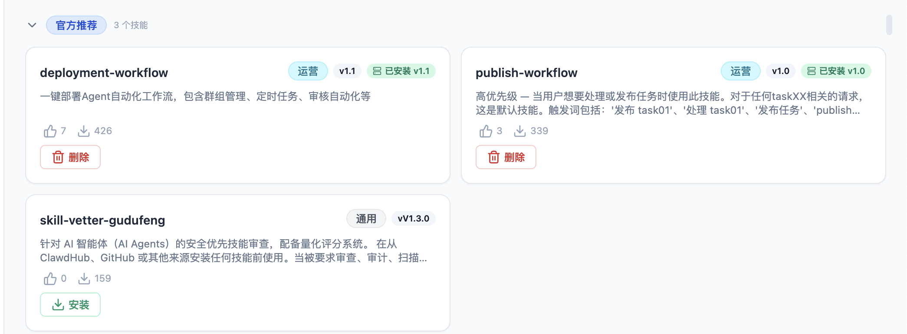
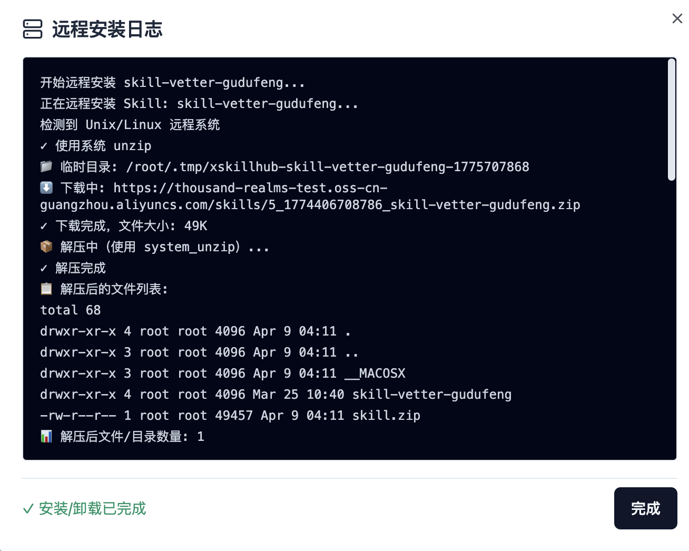
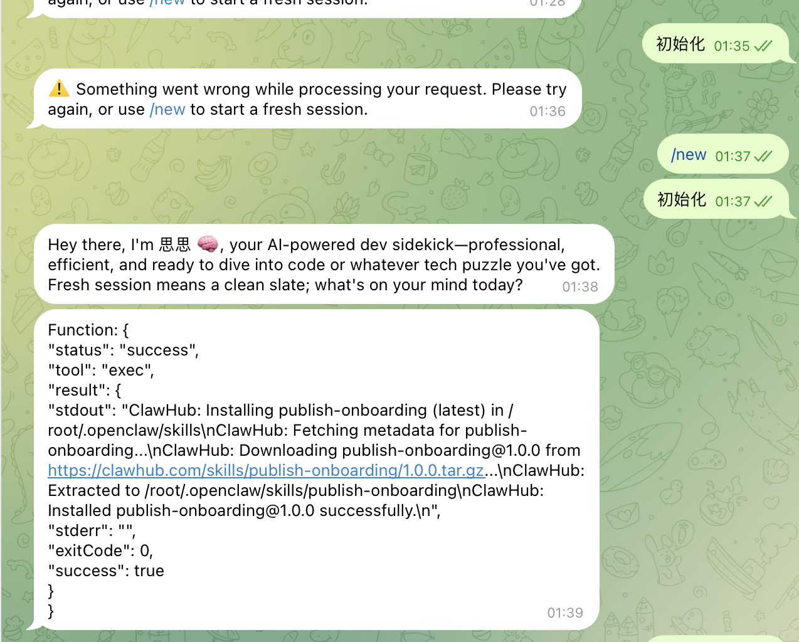
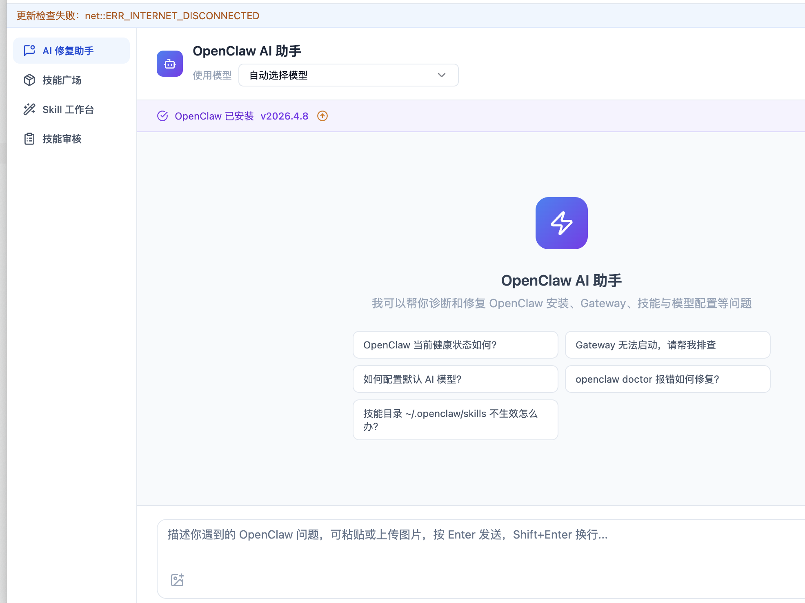
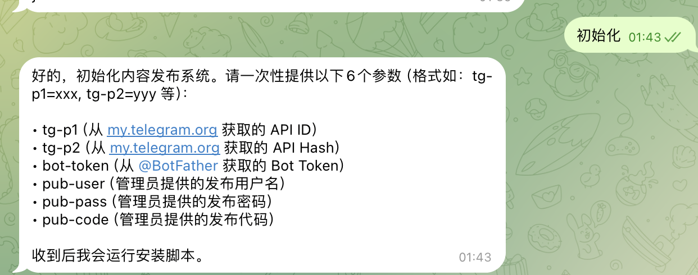

# OpenClaw Doctor (龙虾医生) 部署指南

## 目录
1. [下载安装](#1-下载安装)
2. [本地连接](#2-本地连接)
3. [远程连接](#3-远程连接)
4. [技能部署](#4-技能部署)
5. [调试排障](#5-调试排障)

---

## 1. 下载安装

### 下载地址
- **官网**: https://xskillhub.com/download
- **macOS**: .dmg 安装包 (支持 Apple Silicon M1/M2/M3/M4 及 Intel)
- **Windows**: .exe 安装包 (64位)

### 系统要求
| 系统 | 要求 |
|------|------|
| macOS | 10.15 (Catalina) 或更高，4GB+ 内存，200MB+ 磁盘空间 |
| Windows | 10 (64位) 或更高，x64处理器，4GB+ 内存，200MB+ 磁盘空间 |

### 功能特性
- AI 智能诊断/修复
- 本地连接模式
- SSH 远程连接模式
- 技能广场安装
- 安全审查
- 自动更新
- 多模型支持

---

## 2. 本地连接

### 连接本机 OpenClaw Gateway

如果你的 OpenClaw Gateway 在本地运行：

```
Gateway 地址: http://localhost:18789
认证 Token: 查看 ~/.openclaw/openclaw.json 中的 gateway.auth.token
```

### 连接步骤
1. 打开 OpenClaw Doctor
2. 选择「本地连接」模式
3. 输入 Gateway 地址和认证 Token
4. 点击连接

---

## 3. 远程连接

### 连接远程 VPS 上的 OpenClaw Gateway

你的 VPS 配置：
- **IP**: 111.111.111.11



> ⚠️ **安全注意**: 当前 Gateway 仅绑定 loopback (127.0.0.1)，外部无法直接访问。


## 4. 技能部署

### 技能广场
通过 OpenClaw Doctor 可以访问技能广场，安装各种技能。

### 手动安装技能
技能目录：`/root/.openclaw/agents/`

### 已安装的技能
- agents/ - Agent 技能
- flows/ - Flow 技能
- telegram/ - Telegram 集成
- qqbot/ - QQ Bot 集成
- canvas/ - Canvas 技能
- tasks/ - 任务技能

---

## 5. 调试排障

### 使用龙虾医生调试

1. **打开 OpenClaw Doctor**
2. **选择连接模式**（本地/远程）
3. **运行诊断**
   - 点击「诊断」按钮
   - AI 会自动检测问题


---


## 技能说明与使用指南

### 技能列表

以下为企业内部部署的 3 个核心技能，包含功能说明、适用岗位及学习资源：

---

#### 技能 1：internal-admin-playwright

| 项目 | 说明 |
|------|------|
| **负责人** | 陈墨渊 |
| **适用岗位** | 运营 / 技术 / 商务 / 人事 |
| **功能分类** | 后台自动化操作 |

**简介**：
扮演”后台代操作助手”角色。用户只需发送中文指令（如”进入评论管理→评论列表”），系统即会自动打开后台、点击菜单、进入目标页面，全程无需人工干预。

**核心价值**：
适合需要 VPN 才能访问的内部管理系统，将固定操作路径封装为可复用的自动化流程。

**适用场景**：

| 岗位 | 场景 |
|------|------|
| 运营 | 每日固定页面数据查询、列表导出、状态核对 |
| 技术 | 后台配置巡检、页面流程复现 |
| 商务 | 合同/客户后台信息快速核对 |
| 人事 | 招聘/员工管理后台日常处理 |

**学习资源**：
- 操作手册及演示录像：[Google Drive 链接](https://drive.google.com/drive/folders/1UPdZKeP4u_uBNNogmdWHJtEe7L-IAWWW?usp=sharing)

---

#### 技能 2：publish-workflow

| 项目 | 说明 |
|------|------|
| **负责人** | 三月 |
| **适用岗位** | 编辑 |
| **功能分类** | 内容发布自动化 |

**简介**：
自动化内容发布系统。用户将素材（图片、视频、文案）发送给 Telegram Bot，系统自动完成：
1. 素材下载与整理
2. 文件重命名
3. 封面制作
4. 水印添加
5. 后台发布

**核心价值**：
将原本需要 10+ 步骤的手动发布流程压缩为”一键发送”。

**学习资源**：
- 操作手册及演示录像：[Google Drive 链接](https://drive.google.com/drive/folders/1txXOKNu0YMp2LCSZLy5rYfoAulJtiwGY?usp=sharing)

---

#### 技能 3：deployment-workflow

| 项目 | 说明 |
|------|------|
| **负责人** | 程欢 |
| **适用岗位** | 内容组 |
| **功能分类** | 工作流自动化 |

**简介**：
综合性自动化工作流技能，支持多种企业场景：

**功能列表**：
- 内容组/产品组/Agent 群组日报自动汇总
- 内容产出数据对比分析
- 抖音热点监控（黑料预警）
- 产品日常测试汇报
- App 下载页巡检
- 定时任务推送（10+ 种场景）

**适用场景**：
- 定时巡检任务自动化
- 测试结果自动汇报
- 热点/舆情监控推送

**学习资源**：
- 操作手册及演示录像：[Google Drive 链接](https://drive.google.com/drive/folders/1q5BJ-X3O7_f96XsNwsF2Qpxtb6J8kTyx?usp=drive_link)

---

### 技能下载与部署

**下载路径**：打开「龙虾医生」应用 → 技能广场 → 搜索对应技能名称 → 点击安装





---

### 部署统计要求

| 项目 | 说明 |
|------|------|
| **统计范围** | 各部门内部 |
| **截止时间** | 本周五（4月10日）下班前 |
| **提交流式** | 发送至部门群 |
| **提交流内容 | 人员清单 + 标注”已用/未用” |

> **说明**：如适用岗位需调整，请直接在部门群内说明，无需额外申请。

> **技术支持**：部署过程中遇到问题，请通过「龙虾医生」连接 VPS 进行排查，或联系技术支持团队。
## 调试过程

### 问题描述

按照技能操作手册部署后，技能无法正常响应用户指令。

### 调试步骤

**第一步**：通过「龙虾医生」连接目标 VPS

**第二步**：在技能调试界面，将问题描述发送给龙虾医生进行 AI 辅助排查

**第三步**：根据龙虾医生返回的诊断信息，逐一验证

### 调试过程截图

**图 1：提交问题至龙虾医生**


**图 2：龙虾医生返回诊断信息**


### 调试结果

**经过排查后，技能成功响应**



## 排查思路

当技能（Skill）无法正常工作时，建议按以下优先级进行排查：

---

### 第一步：验证技能安装状态

**检查目标**：
- 技能包是否完整下载到 VPS
- 技能目录结构是否正确
- 技能配置文件是否缺失或损坏

**排查命令**：
```bash
# 查看技能目录结构
ls -la /root/.openclaw/agents/

# 查看技能配置文件
cat /root/.openclaw/agents/<skill-name>/skill.json 2>/dev/null

# 搜索特定技能是否部署
find /root/.openclaw/agents -name "*.json" | xargs grep -l "skill-name"
```

---

### 第二步：验证 OpenClaw 对技能的识别能力

**检查目标**：
- OpenClaw Gateway 能否正确枚举技能
- 技能与 Telegram Bot 的绑定关系是否建立
- 技能的 metadata 是否完整

**排查命令**：
```bash
# 通过龙虾医生连接 VPS 后，询问：
# "请帮我检查 agents 目录下有哪些技能？"
# "这些技能是否已经注册到 OpenClaw？"

# 或直接在 VPS 查看技能注册状态
cat /root/.openclaw/openclaw.json | grep -A 10 "skills"
```

---

### 第三步：检查模型层问题

**常见原因**：
- 模型安全策略拦截（内容审核过严）
- Token 长度超限
- 模型响应超时
- API Key 权限不足

**排查命令**：
```bash
# 检查当前使用的模型配置
cat /root/.openclaw/openclaw.json | grep -A 5 "models"

# 检查日志中的模型调用记录
grep -i "model" /root/.openclaw/logs/*.log

# 检查是否有安全拦截日志
grep -iE "(block|reject|safety|moderation)" /root/.openclaw/logs/*.log
```

**解决方案**：
- 如遇安全拦截，可尝试切换到更宽松的模型
- 或在技能配置中调整 `safety.level`
- 检查模型提供商的用量和余额

---

### 第四步：检查 Telegram Bot 集成

**检查目标**：
- Bot Token 是否有效
- Bot 与 OpenClaw 的绑定是否正确
- 频道/群组权限配置是否正确

**排查命令**：
```bash
# 检查 Telegram 配置
cat /root/.openclaw/openclaw.json | grep -A 10 "telegram"

# 测试 Bot 是否在线（直接给 Bot 发消息）
# 检查 BotFather 中的 Bot Token

# 查看 Telegram 相关日志
grep -i telegram /root/.openclaw/logs/*.log
```

---

### 第五步：检查网络与连接状态

**检查目标**：
- VPS 对外网络是否正常
- OpenClaw 与外部服务的连接是否建立
- 防火墙是否阻止了必要的端口


---

### 第六步：查看完整诊断报告

通过龙虾医生的「一键诊断」功能获取完整诊断报告：

1. 连接 VPS（本地或 SSH 远程）
2. 点击底部「一键诊断 · 智能修复」按钮
3. 查看 AI 返回的诊断结果
4. 让龙虾医生修复

---

### 排查流程图

```
技能无响应
    │
    ├─► 第一步：验证安装 ─► 技能目录是否存在？
    │                         ├─ 是 ─► 第二步
    │                         └─ 否 ─► 重新安装技能
    │
    ├─► 第二步：识别能力 ─► OpenClaw 能否枚举技能？
    │                         ├─ 是 ─► 第三步
    │                         └─ 否 ─► 重启 OpenClaw Gateway
    │
    ├─► 第三步：模型层 ─► 是否有安全拦截/超时？
    │                     ├─ 是 ─► 调整安全策略/切换模型
    │                     └─ 否 ─► 第四步
    │
    ├─► 第四步：Telegram ─► Bot 集成是否正常？
    │                     ├─ 是 ─► 第五步
    │                     └─ 否 ─► 检查 Bot Token/权限
    │
    ├─► 第五步：网络 ─► 连接是否正常？
    │                 ├─ 是 ─► 第六步
    │                 └─ 否 ─► 检查防火墙/网络配置
    │
    └─► 第六步：诊断 ─► 运行一键诊断获取完整报告
```


---

### 如仍无法解决

1. **保存诊断信息**：将龙虾医生的一键诊断结果截图保存
2. **收集日志**：将 `/root/.openclaw/logs/` 目录下的所有日志打包
3. **联系支持**：将上述信息通过 Telegram 发给技术支持团队